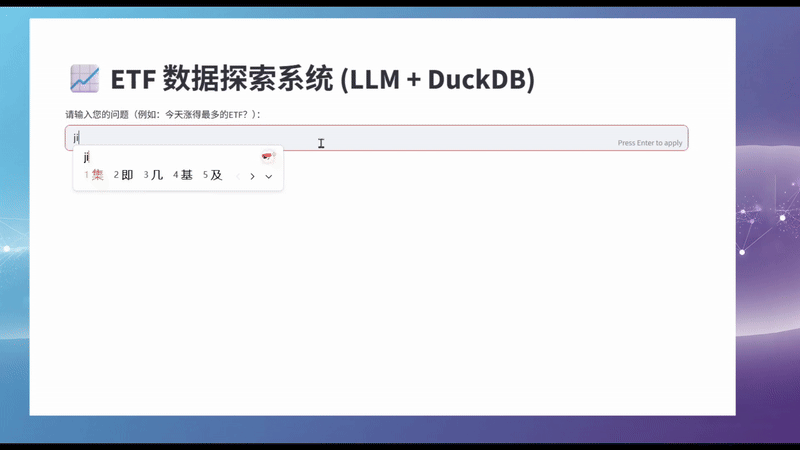

# etf 数据探索 AI 助手


## 技术和架构说明（仅在Windows下测试通过）
- etf日线数据文件以 csv 格式存在 `input_csv` 目录
  执行下面命令加载数据到 `db\etfRAG.duck` 数据库的 `etf_daily` 表

  ```python
  python.exe .\utils\load_csv_2_duck.py    
  
  
- 然后通过下面命令可以生成`etf_daily_metrics` 技术指标表和`etf_daily_returns` 周期收益率表
  ```python
  cd dbt_etf
  dbt run
- 大模型使用的是本地的**Ollama**的 `qwen3:4b` 模型，请自行下载搭建
- 使用下面命令运行界面交互程序 
  ```python
    python.exe .\frontend\streamlit_app.py
      
## 未来考虑
- 增加可以使用云上llm的选项（比如阿里云的dashscope平台）
- 目前仅包含有限的技术指标计算，将来考虑增加更多技术指标
- 增加自动画图功能
- 从简单的 etf 自然语言查询 变成 etf 投研助手
